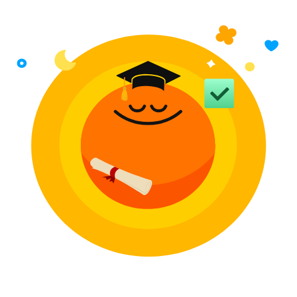

# StudyRacer 🏁📚🐆💨..🐢

Homework has never been this exciting—move over, procrastination! 😎


 
## 🔗 Table of Contents
1. [About the Project](#about-the-project)
2. [Problem Definition](#problem-definition)
3. [Core Concept](#core-concept)
4. [Technology Stack](#technology-stack)
5. [General Solutions](#general-solutions)
6. [Future Development](#future-development)

## 🔭 About the Project

StudyRacer is a web app designed to engage students in managing their academic tasks. By gamifying homework, it transforms studying into a competitive race, making it enjoyable and motivating. The app tracks progress and provides insights, helping students meet their deadlines effectively.

## 💭 Problem Definition

Students struggle with time management, leading to missed deadlines and poor academic performance. StudyRacer helps students stay on top of their work by tracking progress and turning homework into a fun, competitive experience.

👥 Target Audience: Students who struggle with time management.

🎯 Main Goal: Encourage students to complete assignments efficiently by making the process engaging and motivating.

## 💡 Core Concept

### Gamification + To-do Tracker + Progress Tracking

StudyRacer will incorporate elements of competition (leaderboards, progress tracking) and fun rewards (badges, confetti effects) to motivate students to complete tasks on time.

### Features:

- Gamified task list (similar to a to-do app, but with points, rewards, and leveling up)
- Automatic progress tracking
- Leaderboards to create competition between users
- Verification system to ensure that students complete tasks correctly before earning points

## 🛠 Technology Stack

- 
- 
- 
- 

## Front-End Development:

Tech: Next.js, Tailwind CSS

## Back-End Development:

1. Database:

- SQLite

2. API Development:

- Tech: Next.js (for API endpoints)

3. AI Integration:

- OpenAI gpt 4o: (Large Language Model for cross verification when a student submits a draft and declares a checkpoint has been completed)

## How to Run

### Clone the Repository

```bash
git clone https://github.com/bqShina/StudyRacer
cd StudyRacer
```

Install the required packages by running:

```
npm install
```

Create a .env file in the root of the project and configure database connection string:

```
DATABASE_URL="file:./studyracer.db"
```

Generate Prisma Client

```
npx prisma generate --schema=src/prisma/schema.prisma
```

Start the Development Server

```
npm run dev
```

Open your web browser and go to http://localhost:3000 to view the application.

## 🚨 2 examples of generalised solutions to problems encountered during development

- Example 1: Gitwork - Resolving Merge Conflicts Efficiently
While collaborating on StudyRacer, merge conflicts became a frequent issue when multiple team members worked on different features simultaneously. To solve this, we established a clear Git workflow, enforcing practices like frequent commits, pull requests, and code reviews before merging branches

- Example 2: Learning Curve with Next.js - Overcoming Unfamiliarity with the Framework
Several team members were new to Next.js, leading to slower development progress at the start. To address this, we created a learning plan that included online resources, video tutorials, and official Next.js documentation. Pair programming sessions and regular code reviews helped newer members understand key Next.js concepts like routing, API routes, and static site generation. Over time, everyone became comfortable with the framework, leading to smoother and faster development.


## 🚀 Future Development

- Integration with popular student tools like Canvas, Jira, and Notion.
- Build extensions to support more personalized productivity tools.
- Include AI-based suggestions for time management and task prioritization.

## 🎥 Video Demo

https://youtu.be/_Bulh_exZsA?si=ms2umZoUMWzFOSGr
